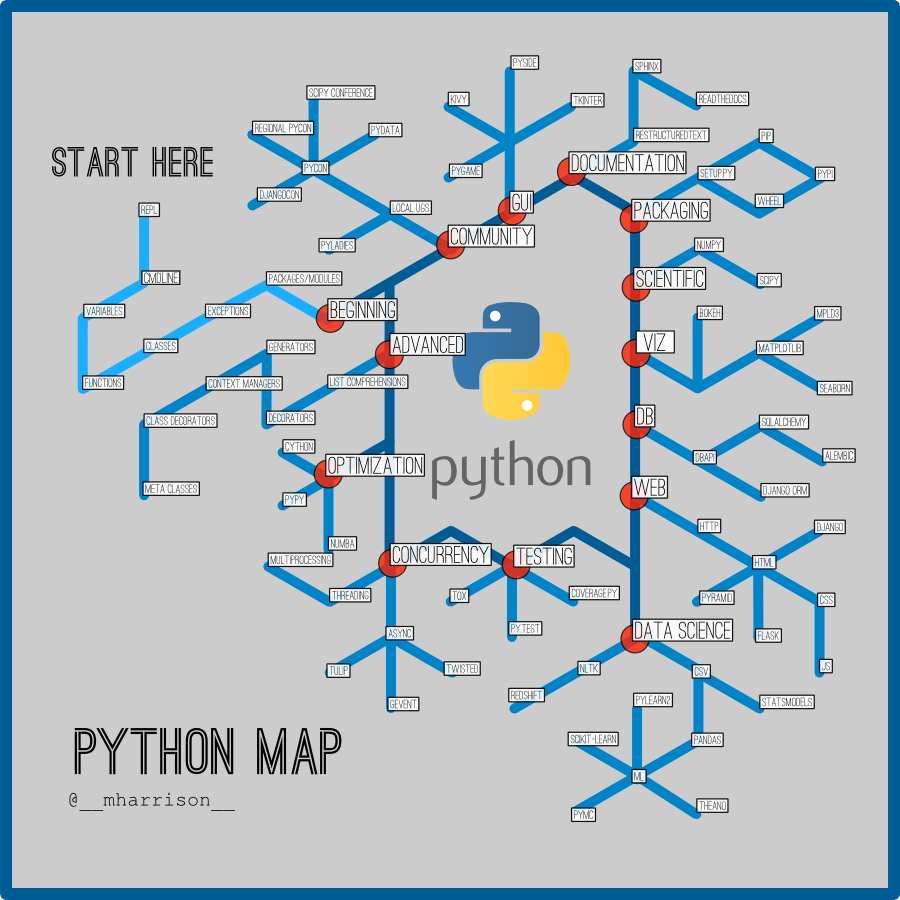

# Python

# Sites
[Python Brasil](https://wiki.python.org.br/PythonBrasil)

## Exercicios
Exercicios resolvidos das listas do site [Python Brasil](https://wiki.python.org.br/ListaDeExercicios).

* [Estrutura Sequencial](python/exercicios/ES) [:white_check_mark:](python/exercicios/ES)
* [Estrutura de Decisao](python/exercicios/ED)
* [Estrutura de Repeticao](python/exercicios/ER)
* [Exercicios Listas](python/exercicios/EL)
* [Exercicios Funcoes](python/exercicios/EF)
* [Exercicios com Strings](python/exercicios/ES)
* [Exercicios Arquivos](python/exercicios/EA)
* [Exercicios Classes](python/exercicios/EC)
* [Lista de Exercicios Projetos](python/exercicios/EP)

